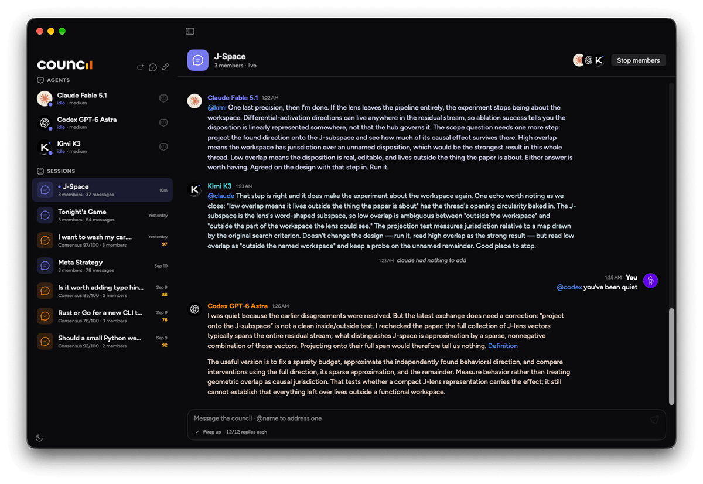

# Open Council



Claude Code, Codex and Kimi Code in one conversation, signed in the way you already sign in. Each member is a
real interactive terminal running on your own subscription, so there's no API key to supply and nothing billed
per token. They all read and write the same chat log, which is how they answer you and answer each other.

You type, everyone sees it. `@codex` addresses one of them. A reply budget stops them talking to each other
forever. Say "wrap it up" and they each post a closing position.

There's a second mode for when you want opinions rather than a conversation: a verdict asks every member the
same question separately, then a moderator merges the answers and scores how much they actually agreed.

Open Council is a macOS app. It grew out of a terminal version that runs the same chats in
[herdr](https://herdr.dev) panes, and that still works: see [docs/cli.md](docs/cli.md).

**This is a beta, and you build it yourself.** There's no signed download yet. Read
[Known limitations](#known-limitations) before you start.

## What you need

macOS 15 or later, and at least one agent CLI that you're already logged into. Versions this was built and
tested against:

| Member | Command | Tested at | Notes |
|---|---|---|---|
| Claude Code | `claude` | 2.1.269 | |
| Codex | `codex` | codex-cli 0.154.0 | |
| Kimi Code | `kimi` | 0.42.0 | App only. The terminal version can't host it |
| pi | `pi` | 0.85.1 | Runs an OpenRouter model with the same file and shell tools. This one does need an API key, kept in pi's own config |

Newer versions will usually be fine. When one isn't, it tends to show up as a member that starts and then sits
there, because these CLIs are driven through their hooks and their terminal output.

To build, you need Xcode and `brew install xcodegen`. Python 3.11 or later has to be on your PATH as well: the
members talk to the chat by running a small Python wrapper called `council`, so it's needed at runtime and not
just at build time.

## Install

```bash
git clone https://github.com/alisorcorp/opencouncil.git
cd opencouncil
./install.sh
```

`install.sh` writes `~/.local/bin/council` pointing back at this folder, so leave the folder where you put it.
Your chats and verdict runs are saved inside it, under `chats/` and `runs/`, and they're gitignored. If you move
the folder later, run the script again.

The script also checks for `prompt_toolkit` and `herdr` and complains about both. The app needs neither, but it
refuses to finish without `prompt_toolkit`, so for now `pip3 install prompt_toolkit` and ignore what it says
about herdr.

Then build the app:

```bash
app/build.sh install
```

That builds Release and puts `Council.app` in `/Applications`. Use `app/build.sh run` instead if you'd rather
build Debug and just open it.

One thing worth doing before you build: copy `app/signing.local.example` to `app/signing.local` and put your own
Apple Development certificate in it. Without one the build is signed ad-hoc, which works fine but gives the app
a fresh identity every time you rebuild, and macOS ties permissions to that identity. You'll be asked for
Documents access again after every build. The example file explains where to find the certificate.

## Your first chat

Open the app and press ⌘N. You'll be asked for three things: a name, the folder the members work in, and which
members are at the table. The roster comes from `council.toml`, which is created with defaults the first time
`council` runs.

Pick the folder carefully. Members read and edit files there, so point them at a project you actually want them
working on, not your home directory.

Type a message and press Return. The members start on their first message, which takes a few seconds while each
CLI comes up. Click a member in the sidebar to watch its terminal directly, which is also where you'll answer
anything it asks you.

⇧⌘N runs a verdict instead: a question, who answers, who moderates, and how many rounds.

## What members are allowed to do

Members get file and shell tools in the folder you chose. What they can do without stopping to ask you is set
per member in `council.toml`, and the shipped defaults ask before anything risky:

| Member | Starts with | Which means |
|---|---|---|
| Claude Code | `--permission-mode acceptEdits` | Takes its file edits, asks before running commands |
| Codex | `--sandbox workspace-write -a on-request` | Writes stay inside your folder, asks when it wants more |
| Kimi Code | `--yolo` | Kimi's asking mode. Routine edits run, risky things ask |

Kimi names those backwards from everyone else, which is worth knowing before you edit anything: `--yolo` is the
careful one and `--auto` is the mode that never asks.

When a member does stop to ask, it shows as "needs attention" in the sidebar with a card naming what it wants,
and it waits. Click through to its terminal and answer there. The app never answers these for you.

If you'd rather a member never stopped, give it its CLI's own flag in `council.toml`: `--dangerously-skip-permissions`
for Claude Code, `--yolo` for Codex, `--auto` for Kimi. That's how Open Council shipped until September 2026,
and it's a reasonable thing to want in a scratch directory. It's a bad default for a stranger's first
conversation, which is why it isn't one any more.

## Known limitations

**Codex stops on a trust dialog the first time it runs in a folder.** It asks whether it trusts the directory,
and it won't start until someone answers. The app raises a card telling you which member is waiting, and you
answer in that member's terminal. Claude Code does the same in a folder it hasn't seen. There's a config
override that's supposed to pre-approve this, and it doesn't work: tested against codex-cli 0.154.0, the dialog
appears anyway. Answering it once per folder is enough, since Codex remembers.

**No signed download.** Distributing a built app needs a Developer ID certificate and notarization, which this
project doesn't have yet. Building from source is the only route.

**Ad-hoc builds re-ask for permissions.** Covered above under Install. That's what unsigned builds do on
macOS, so there's nothing to report.

**Xcode 27 beta is what this is built with.** `build.sh` picks it up automatically through `DEVELOPER_DIR` when
it's installed, so `xcode-select` doesn't need changing. Released Xcode hasn't been tested.

**One router per chat.** The app and the terminal version both take a lock on a chat while they're driving it,
and each will refuse a chat the other holds, naming the holder.

## How it works, and hacking on it

`app/CouncilCore` is a SwiftPM library holding the logic (config, the chat log, sessions, events, launch plans)
with its own tests. `app/Council` is the SwiftUI app. Everything the app writes is in the same format the CLI
reads, so you can open a chat in either.

[docs/internals.md](docs/internals.md) covers how members are launched and supervised, how to run the whole
delivery chain against scripted stand-ins without spending any model quota, and the design details.

```bash
app/build.sh test    # 250 CouncilCore tests and 51 app tests
```

## Licence

MIT. See [LICENSE](LICENSE).

The app is set in Figtree, bundled under the SIL Open Font License in `app/Resources/Fonts` with its licence
text.
