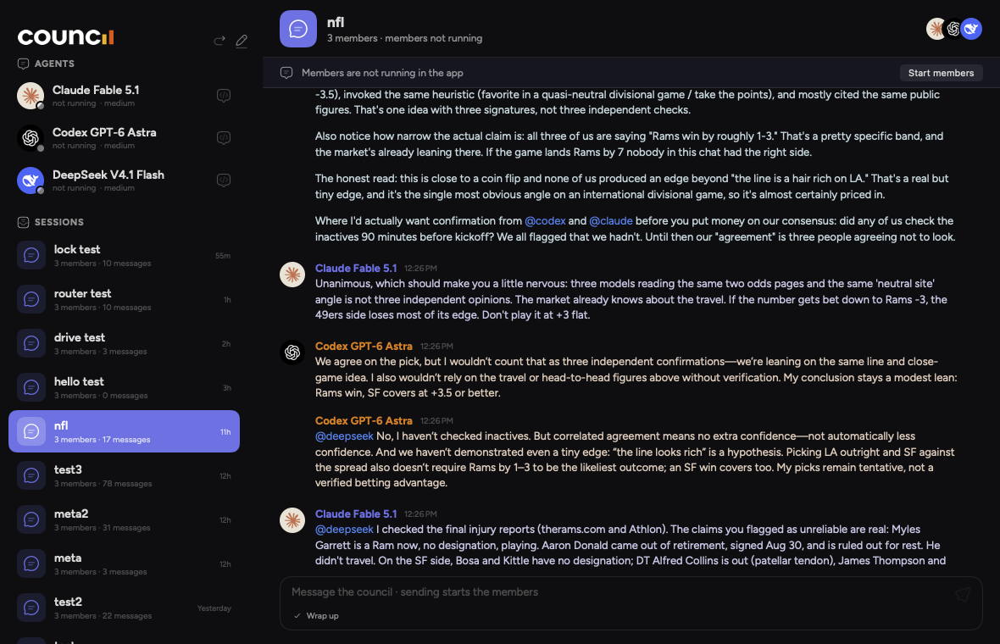

# Open Council


Multi-model conversations inside [herdr](https://herdr.dev). The command is `council`. Two modes:

- **`council session NAME`** – a live group chat. You on the left, Claude Code, Codex and DeepSeek stacked on the right. Members reply, @mention each other, and keep going until you say "wrap it up".
- **`council ask "question"`** – a [council-ai.app](https://council-ai.app/)-style verdict. Every member answers independently in its own pane, then a moderator merges the answers and scores the consensus.

## Setup

Everything is two Python files plus `council.toml`; the members are the CLIs you already use, running under their own logins. Nothing is installed globally except a one-line wrapper.

Requirements:

1. **Python 3.11+** (uses `tomllib`) and the `prompt_toolkit` package for the chat window: `pip3 install prompt_toolkit`.
2. **herdr** on PATH (`herdr --version`). The chat and verdict layouts are herdr panes; `council session` starts and attaches herdr sessions.
3. **Claude Code** (`claude`) logged in. `council members` checks `claude auth status`. Verdict mode runs `claude -p` with `ANTHROPIC_API_KEY` removed from the environment so it uses the claude.ai login, not an API key.
4. **Codex CLI** (`codex`) logged in (`codex login`; `~/.codex/auth.json` must exist).
5. **pi** ([pi-mono](https://github.com/badlogic/pi-mono)) on PATH. It runs the OpenRouter member with the same file/bash tools as the other two. Install it separately; on the machine this was built on it came from the npm package `@earendil-works/pi-coding-agent` (pi 0.85.1).
6. **An OpenRouter API key**, stored in pi's own config, `~/.pi/agent/models.json`. council never reads the key itself; pi does. Create the file if it doesn't exist, using `pi-openrouter-models.example.json` from this folder as the template: put the key in `providers.openrouter.apiKey` and keep the `models` entry for `deepseek/deepseek-v4.1-flash` (pi's built-in catalog didn't list V4.1 as of pi 0.85.1; if `pi --list-models deepseek` shows it, the entry is optional but harmless). Test with:

   ```
   pi -p --provider openrouter --model deepseek/deepseek-v4.1-flash --no-session "say hello"
   ```

Install:

```
unzip council.zip && cd council
./install.sh            # writes ~/.local/bin/council pointing at this folder, checks Python and prompt_toolkit
council members         # every row should show a green dot
council session test    # opens herdr session "test" with the chat; type something, then say "wrap it up"
```

`install.sh` only creates the wrapper; keep this folder where it is (chats and verdict runs are saved inside it, under `chats/` and `runs/`). If `~/.local/bin` isn't on your PATH, the script says so.

Members and their flags live in `council.toml` (Claude Code runs with `--dangerously-skip-permissions`, Codex with `--yolo`; change `chat_args` if you want prompts). Labels are cosmetic. To use a different OpenRouter model, register it in `~/.pi/agent/models.json` and point `[members.deepseek].model` at it, or add another `[members.NAME]` block with `backend = "pi"`.

## Chat

```
council session planning          # from a plain terminal: opens herdr session "planning" with everything loaded
council session planning          # again later: re-attaches, or resumes the chat if herdr was restarted
council session planning --new    # start a fresh chat under the same name
council chat                      # same layout as a new tab, when you're already inside herdr
```

Members come up signed in with their normal logins: Claude Code with `--dangerously-skip-permissions --effort medium`, Codex with `--yolo -c model_reasoning_effort="medium"`, and DeepSeek V4.1 Flash running inside [pi](https://github.com/badlogic/pi-mono) (`pi --provider openrouter --model deepseek/deepseek-v4.1-flash --thinking medium`), so it has the same read/bash/edit tools as the other two. Change the effort with `--effort high` or `[chat].effort` in `council.toml`.

How the chat works:

- What you type goes to every member. `@codex …` goes only to Codex.
- A member's message that @mentions someone is delivered to them and they reply. A message without mentions is visible to all but triggers no reply, so exchanges end on their own.
- Say "wrap it up" (or `/wrap`) and everyone posts a final position without mentions. Your next message resumes normal routing.
- A budget (default 12 member replies per message you send) stops runaway loops. `/budget N` changes it.
- `/mute name`, `/unmute name`, `/who`, `/help`, `/quit` (leaves the chat; the members keep running in their panes).

Members speak by running `council post --as NAME "…"` in their own terminal. Their panes stay visible on the right, so you can watch them read files or run commands while they think. `council log` prints the chat; `transcript.md` in the chat directory is kept up to date.

Each chat lives in `chats/<timestamp>_<name>/` with `chat.jsonl` (the log), `config.json`, and `transcript.md`. `chats/current` points at the latest.

Resuming: `council session NAME` reuses the latest chat named NAME instead of starting an empty one. If the herdr session was restarted (reboot, closed herdr), herdr brings back the layout and the Claude Code and Codex sessions on its own; council then relaunches the chat window with the history, starts the members herdr couldn't restore (pi keeps no session) in their old panes with a note to read `transcript.md` first, and re-briefs the rest. Members come from the current `council.toml`, so a changed roster takes effect on resume. `--new` forces a fresh chat.

## Verdict

```
council ask "Should we migrate this service from Postgres to SQLite?"
council ask -f plan.md "Critique this plan"            # attach files (repeatable)
council ask -r 2 --anonymous "..."                     # members critique each other; shown as Model A/B/C
council ask -m claude,codex,gemini --moderator codex "..."
council ask --inline "..."                             # no panes; verdict prints here
council runs                                           # past runs with consensus scores
council show [run]                                     # print a verdict; -t for the transcript
```

Member panes across the top, moderator across the bottom. Round 1 answers are independent; with `-r 2` each member sees the others' (anonymized) answers and revises before the moderator synthesizes. Runs are saved under `runs/`.

## Members and backends

`council members` checks that each configured member is reachable. Configured in `council.toml` (created with defaults on first run).

| backend  | verdict mode                                  | chat mode                                  |
|----------|-----------------------------------------------|--------------------------------------------|
| `claude` | `claude -p`, tools off, claude.ai login       | interactive Claude Code in a herdr pane    |
| `codex`  | `codex exec`, read-only sandbox               | interactive Codex in a herdr pane          |
| `pi`     | `pi -p`, tools off, any provider pi knows     | interactive pi in a herdr pane, with tools |
| `openai` | any OpenAI-compatible chat endpoint           | a small streaming client, no tools         |

`pi` members take `provider` and `model`; pi's own `~/.pi/agent/models.json` supplies the keys (DeepSeek V4.1 Flash and Gemini 3.8 Flash are registered there under the OpenRouter provider; Gemini stays configured as an optional member). For `openai` members the key comes from `api_key`, `$api_key_env`, or a dotted path into a JSON file (`api_key_file` + `api_key_json`).

## Notes

- `claude -p` runs with `ANTHROPIC_API_KEY` removed from its environment so it uses the subscription login rather than the API key.
- The Gemini CLI is not used: Google retired its individual tier, so Gemini (when used) goes through OpenRouter, driven by pi.
- Chat coordination is a JSONL file plus `herdr agent prompt`; nothing scrapes terminal output. A member that dies or stays silent shows as a dim note in the chat.

## macOS app (in progress)

`app/` holds a native macOS app that will replace herdr as the host for council: a chat-client window with the
agents and sessions in a sidebar, Markdown conversations, and the member CLIs running as hidden terminals on their
own logins. Requirements and the phased plan live in `docs/brainstorms/` and `docs/plans/`; the plan's checkboxes
are the progress record. Today the app opens the chats and verdict runs in this folder, starts their members in
embedded terminals, routes what you type to a chat, and runs a verdict from the question to the moderator's
score.



Build (`brew install xcodegen` once; Xcode 27 beta is used through `DEVELOPER_DIR` when it is installed, so `xcode-select` does not need changing):

```
app/build.sh            # generate the Xcode project from app/project.yml and build Debug
app/build.sh test       # CouncilCore unit tests + app tests
app/build.sh run        # build and open Council.app
app/build.sh install    # build Release and put Council.app in /Applications (or a directory you name)
app/build.sh snapshot chats/<dir> out.png [w h] [--dark] [--live] [--terminal <member>]  # render the window offscreen to a PNG
app/build.sh drive chats/<dir> "<message>" [--timeout s] [--to a,b]     # start members, post, report hooks, posts and the reaction pass
app/build.sh ask runs/<dir> [--timeout s]                              # run a verdict: ask every member, then the moderator
```

`app/CouncilCore` is a SwiftPM library with the logic (config, bus, sessions, events, launch plans) and its tests;
`app/Council` is the SwiftUI app. The app reads `council.toml`, `chats/` and `runs/` exactly as the CLI writes them
and never edits `config.json`; anything it needs to remember per session goes in an `app.json` next to it
(session ids, last seen message, live flag). Members keep posting through `council post`, so keep the wrapper in
`~/.local/bin` installed.

Members run inside the app as hidden SwiftTerm terminals, one per member, started from a chat's "Start members"
banner. Each terminal gets `COUNCIL_CHAT` and `COUNCIL_AS` in its environment, so `council post` cannot post as
someone else, and the CLI's hooks call `council event`, which appends to `events.jsonl` in the session folder;
the app tails that file to know when a member started, took the prompt, ran a tool, finished, or needs a human.
Clicking an agent in the sidebar shows its terminal. While the app pastes a message into a terminal, keyboard input
to that terminal is dropped so the paste cannot be interleaved with keystrokes.

⌘N starts a chat: a name, the folder the members work in, and who is at the table, all read from `council.toml`.
The directory it writes is the CLI's, so `council session <name>`, `council log` and `council post` all accept it.

Typing in the composer posts to `chat.jsonl` as `user` and starts the members if they are not running yet. Who
gets prompted follows the same rules as the CLI: a message without mentions goes to everyone, `@name` goes to that
member, a member's reply goes to whoever it mentions, each hop spends one of the chat's reply budget, and "wrap it
up" asks for final positions and stops routing mentions. Bursts within four seconds arrive as one delivery, and a
member is only prompted once it is idle, so nothing is pasted on top of a turn in progress. When a message the
whole council received has been answered by everyone, each member is asked once to read the others and reply only
if it has something to add (the reaction pass); it costs one reply from the budget and is skipped while wrapping up.

⇧⌘N asks the council: a question, who answers it, who moderates, how many rounds, whether the members see each
other's names, and the folder they work in. Submitting the sheet starts the run. Pick a folder you have used the
CLIs in before: Claude Code asks whether you trust a folder the first time it runs in one and answers "No, exit"
by default, and it skips that question only in non-interactive mode, which this project does not use. Trust is
inherited from a trusted parent, so a folder beside ones you already use starts clean.

Every member gets a hidden terminal of its own, is pasted the same prompt the CLI would send
it, and answers with `council post`; the app writes each answer to `r<N>/<member>.md` with a `.done` record
beside it, then asks the moderator and saves `verdict.md` and `transcript.md` — the same directory `council runs`,
`council show` and a resumed `council ask` read. A member that never answers is recorded as having failed and the
moderator proceeds with what it has, as long as two members answered. A run interrupted by quitting the app
offers Resume, which asks only for the answers that are missing; a moderator that gave up offers Retry, which
keeps every answer. The members' own bus, events and ledger live in a hidden `.app/` folder inside the run, so
the run directory itself holds only what the CLI would have put there. Runs the app creates take only members it
can host as terminals — an `openai` member's credentials live in `council.toml` under keys the app does not model.

Only one router may drive a chat at a time. The app takes `router.lock` in the session folder when members start
and drops it when they stop or the app quits; `council chat`/`council session` take the same lock and each refuses
a chat the other is holding, naming the holder. A lock whose process is gone is taken over automatically.

Set `COUNCIL_FAKE_MEMBERS=1` to run `app/Tools/fake-member.py` in place of every CLI: a scripted stand-in that
enables bracketed paste, emits the same hook events and replies through `council post`, so the whole delivery
chain can be exercised without spending model quota. Its `FAKE_*` variables simulate slow starts, permission
prompts, crashes, silence and "nothing to add"; `FAKE_ONLY=<name>` applies them to one member of a run.
`app/build.sh drive` and `app/build.sh ask` are the headless harnesses for this, and
`app/Tools/integration/fake-member-flows.sh` runs the whole scenario set.

Signing is per-machine and deliberately not in the repo. Without `app/signing.local` the build is **ad-hoc**,
which builds and runs anywhere but gives the app a new identity on every build — so macOS asks again for
Documents access after each rebuild, and anything your Claude Code or Codex hooks do through AppleScript prompts
again as "Council.app wants to control System Events", because the CLIs run as the app's children. Copy
`app/signing.local.example` to `app/signing.local` and name your own Apple Development certificate and team to
stop that: macOS keys its grants to the signature, and a real one is stable across rebuilds. The example file
explains where the certificate comes from, including the chain problem that reports a perfectly good certificate
as "0 valid identities found". The test host never touches the council folder, for the same reason.

The app is set in Figtree (SIL OFL 1.1, bundled in `app/Resources/Fonts` with its licence and registered through
`ATSApplicationFontsPath`), so nothing needs installing; only the terminal and fenced code stay monospaced. The
palette is indigo `#3D348B`, periwinkle `#7678ED`, amber `#F7B801`, orange `#F18701` and vermilion `#F35B04` on a
`#0B0B0F` canvas in the dark.

Two start-up states are normal and show up as the member's status. A folder the CLI has not seen before makes
**both** Claude Code and Codex ask whether you trust it; the member reads "needs attention" with a card naming
the dialog, and you answer it in that member's terminal (click the agent row). The app never answers a trust
prompt itself — it used to, by accident, because the briefing it pasted ended in the Enter that selected "Yes".
Trust is inherited from a trusted parent folder, so a fresh working directory under one you have already
approved starts clean. Codex also reports its session only with the first prompt, so the app declares it ready
once its screen has settled; "starting…" for a few seconds after launch is expected.

