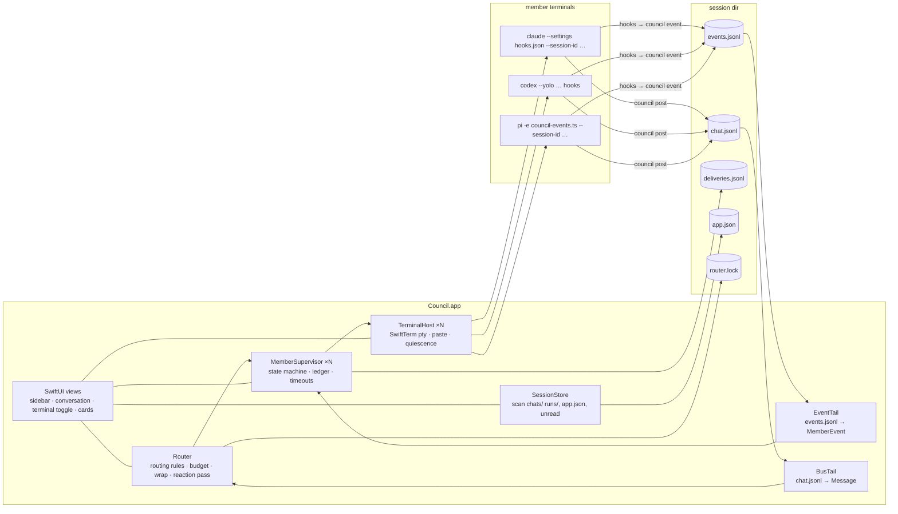
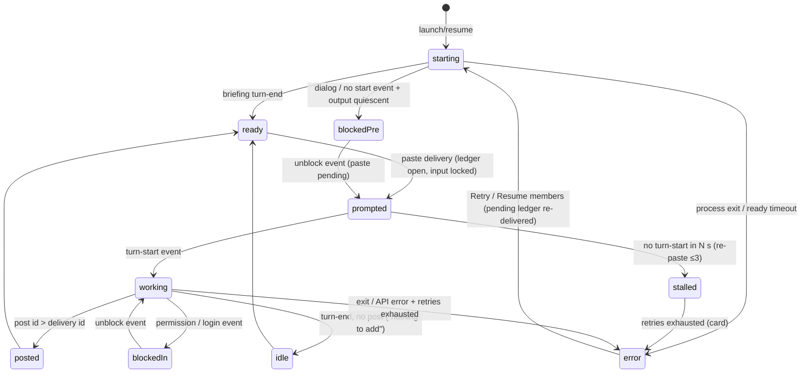
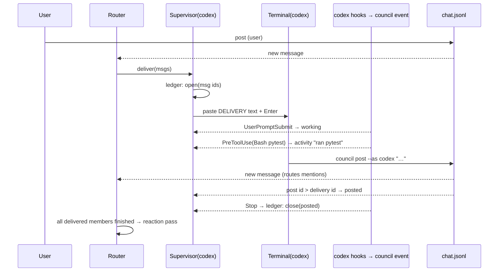

# feat: Native macOS Council app

## Overview

Build a native macOS app (SwiftUI + AppKit, macOS 15+) that replaces herdr as the host for council. The app renders the chat natively, hosts Claude Code, Codex and pi as real interactive terminal sessions on their own logins, keeps those terminals hidden until asked for, observes member state through each CLI's own hook/event mechanism instead of screen scraping, resumes member sessions after a restart, and runs verdict mode through the same machinery. The existing Python `council` CLI stays as the helper members use to post, and the on-disk `chats/` and `runs/` layout is preserved so both worlds read the same data.

## Problem Frame

council today is `council.py` + `chat.py` driving herdr panes. Conversations read as wrapped terminal text, member state detection is fragile (pi is invisible to herdr and is scraped), and herdr owns layout, prompt injection and restart recovery. The requirements doc (see origin) asks for a two-column chat client where the agents are the hero and the terminals are one click away, with three switching criteria: better reliability than herdr, readable conversations, and surviving restarts.

## Requirements Trace

From the origin document. IDs are stable and referenced by implementation units.

- R1–R5 Layout: two columns, Agents + Sessions sidebar, agent click toggles conversation ↔ that member's terminal, terminals otherwise hidden.
- R6–R11 Conversation: Markdown bubbles, mention chips + autocomplete, live activity line, inline system notes, composer with wrap/budget/mute, input never locked.
- R11a Reaction pass: after every delivered member has finished its turn on a user message, each is prompted once to read the others and reply only if it has something to add.
- R12–R15 Members: Claude Code, Codex and pi as interactive terminals on OAuth/own keys; blocked/error cards with Open terminal; every delivery ends in reply, nothing-to-add note, or card; members post via `council post`.
- R16–R21 Sessions: new-session sheet, chat + verdict share the list, verdicts use fresh hidden sessions, restart restores the open session and resumes Claude Code and Codex (pi too, see decisions), on-disk compatibility, notifications.
- Success criteria: you stop using `council session`; fewer stalled prompts and missed completions than herdr and none silent; transcripts reread in the app; reboot → click session → members resumed with no manual steps.

## Scope Boundaries

Carried from origin: no editing of council.toml in the app; no herdr integration; one terminal at a time; no App Store / sandbox; no iOS, sync or multi-user; no headless mode for Claude Code or Codex.

Planning additions:
- The Python CLI is modified only where the app needs a helper contract (`council event`, `COUNCIL_AS` enforcement in `post`, `router.lock`). The herdr flow itself is not reworked.
- The `openai` backend (direct HTTP members) is out of scope for the app's first version; council.toml members with that backend are shown as unavailable in the new-session sheet.

## Context & Research

### Relevant Code and Patterns

- `chat.py` `Bus` (append with `fcntl.flock`, read all), `Router` (`route`, `deliver_loop` with the 4 s burst coalescing, budget, `wrapping`, `muted`), `BRIEFING` / `RESUME_BRIEFING` / `DELIVERY` / `WRAP_NOTE` templates, `format_lines`, `transcript`, `prepare_chat` (config.json shape, `chats/<stamp>_<slug>/`), `resolve_chat` (`--chat`, `$COUNCIL_CHAT`, else `chats/current`), `cmd_post`, `DEFAULT_CHAT_ARGS`, `EFFORT_ARGS`.
- `council.py` `Run` (config.json, `question.md`, `r<N>/<member>.md`, `r<N>/<member>.done`, `verdict.md`, `transcript.md`), `create_run`, `member_prompt`, `moderator_prompt`, `MEMBER_SYSTEM` / `CRITIQUE_PROMPT` / `MODERATOR_SYSTEM` / `MODERATOR_PROMPT`, `parse_score`, `write_transcript`, `cmd_runs` / `cmd_show` (what the CLI reads back), `pi_model_args`, `load_config`.
- `council.toml`: `[chat]` (members, budget, effort), `[members.*]` with `backend`, `label`, `model`, `provider`, `chat_args`.
- Sample data to use as fixtures: `chats/2026-09-10_113600_nfl/` (config.json with herdr `agent` fields, chat.jsonl, transcript.md) and `runs/2026-09-09_152736_*/` (two rounds, verdict, .done files).
- Existing chat.jsonl message shape: `{id: time_ns, ts, from, kind: msg|note, text, to: [mentions]}`.

### Institutional Learnings

- No `docs/solutions/` in this repo. Relevant memory: `herdr agent prompt` reports pi prompts as stalled always; pane reads are empty on unrendered panes. Both are reasons the app must not depend on scraping.

### External References (verified 2026-09-10 unless marked)

- Claude Code hooks fire in interactive mode; events include SessionStart (`session_id`, `reason`), UserPromptSubmit, PreToolUse/PostToolUse (`tool_name`, `tool_input.file_path` / `tool_input.command`), Stop (`last_assistant_message`, `stop_reason`), Notification (`permission_prompt`, `idle_prompt`, `agent_needs_input`, auth/elicitation types), SessionEnd. `--settings <file|json>` supplies settings per launch; `--session-id <uuid>` pre-assigns the id; `--resume <id>`; `--effort low|medium|high|xhigh|max`. https://code.claude.com/docs/en/hooks , /sessions , /cli-reference . Unverified: whether `--settings` merges with or replaces `~/.claude/settings.json`; whether the new-cwd trust dialog can be suppressed.
- Codex CLI 0.154 has hooks: PreToolUse, PermissionRequest, PostToolUse, UserPromptSubmit, Stop, SessionStart (`source`), SessionEnd, Interrupt, loaded from `~/.codex/hooks.json` or `[[hooks.X]]` in config.toml; stdin JSON with `session_id`, `cwd`, `hook_event_name`, `tool_name`, `tool_input`. Legacy `notify` fires `agent-turn-complete` with `thread-id`. `codex resume <id>`; no pre-assigned id. Trust/onboarding suppression via `-c 'projects."<abs>".trust_level="trusted"'`, `-c check_for_update_on_startup=false`, `notice.hide_*`. https://learn.chatgpt.com/docs/hooks , /config-file/config-reference , /developer-commands . Unverified: passing a hooks block through `-c`.
- pi 0.85.1: extensions via `-e <path>` with `session_start`, `agent_start`, `agent_end`, `turn_start`, `turn_end`, `tool_call`, `tool_execution_start/end`, `input`, `project_trust` events and Node `fs`/`pi.exec` available; sessions persisted, `--session-id <id>` creates or resumes; `--mode rpc` exists but is out of scope (terminals required). https://github.com/earendil-works/pi/blob/main/packages/coding-agent/docs/extensions.md , .../session-format.md . Known bug: multi-line paste submits at first newline under tmux (issue 2376).
- SwiftTerm v1.19.0 / v1.20.0 (2026-08-18); `LocalProcessTerminalView.startProcess(executable:args:environment:currentDirectory:)`, `send(txt:)`, `processTerminated`, buffer access via `getLine(row:)` / `getBufferAsData`, pty keeps flowing when the view is detached; `main` is about to break API, so pin a tag. https://github.com/migueldeicaza/SwiftTerm . Claude Code flicker remedy: `CLAUDE_CODE_FORCE_SYNC_OUTPUT=1`.
- Markdown: Textual 0.5.0 (macOS 15+, code blocks, tables, built-in highlighter) recommended over MarkdownUI (maintenance mode, perf issues on long text). https://github.com/gonzalezreal/textual
- TOML: TOMLDecoder 0.4.5 (dduan), Codable decode, TOML 1.1. https://github.com/dduan/TOMLDecoder
- Scaffolding: XcodeGen 2.46 with a local SwiftPM library package; pure SwiftPM cannot make a .app bundle. Notarization needs Developer ID + hardened runtime, not sandbox; no entitlement needed for fork/exec/pty. UNUserNotificationCenter requires a bundled app; ad-hoc signing sufficiency unverified.
- Shell PATH: GUI apps do not get shell env; resolve via a login shell with sentinel and timeout (VS Code pattern), fall back to `/etc/paths` + known dirs.

## Key Technical Decisions

- **Pure Swift port, Python stays as the helper.** Router, bus, prompts, verdict logic and event normalization are ported into a SwiftPM library `CouncilCore` with unit tests. The Python `council` CLI remains the tool members call (`post`, `log`) and gains `event`. A Python sidecar was rejected: the app owns the ptys, so a sidecar router would have to call back into the app to paste prompts, inverting control for no gain on ~300 lines of logic.
- **Events channel = file, not socket.** Every CLI hook runs `council event --as NAME --backend X`, which appends the raw hook payload (plus member, backend, hook name, timestamp) to `events.jsonl` in the session directory. The app tails it with a `DispatchSource` exactly like `chat.jsonl`. Normalization to app-level events happens in Swift where it is testable against fixtures. Rationale: same mechanism as the bus, works when the app is not running (events are not lost), no server lifecycle.
- **Per-member environment pins identity.** Each terminal is launched with `COUNCIL_CHAT=<session dir>` and `COUNCIL_AS=<member>`. `council post` refuses a mismatching `--as` and refuses `--as user` when `COUNCIL_AS` is set; `council event` uses the same variables. The app never touches `chats/current`. Closes flow gaps G1/G2.
- **Hook wiring per backend.** Claude Code: a per-launch settings file generated by merging the user's `~/.claude/settings.json` with the app's hook entries, passed via `--settings`, so behaviour is unchanged whether the flag merges or replaces. Codex: try hooks via `-c` overrides first; if that cannot express a hooks block, install an env-gated block into `~/.codex/hooks.json` once (`council install-hooks`, merge not clobber, no-op when `COUNCIL_CHAT` is unset). pi: ship `pi-council-events.ts` and pass `-e`. `notify` is not used.
- **Session ids.** Claude Code and pi get a pre-assigned UUID at launch (`--session-id`); Codex's id is read from its SessionStart payload. All three are stored in `app.json` in the session dir. pi now keeps sessions (drop `--no-session` in the app's launch args), so pi is resumed too, improving on herdr.
- **App state lives in `app.json`, never in `config.json`.** `config.json` stays CLI-owned (the CLI rewrites it on resume). `app.json` holds session ids, cwd override, last-seen message id, live/read-only state. `deliveries.jsonl` is the delivery ledger. `router.lock` marks who is routing. Closes G3/G7/G4.
- **Explicit member state machine** (see design below) drives the sidebar dot, activity line, cards, ledger and the reaction-pass gate. Blocked is split into pre-prompt and in-turn. Quiescence (no pty output for N seconds) is a fallback signal only, used when a backend emits no turn-end.
- **Sessions open read-only; members start on demand.** Clicking a session shows history without launching anything. "Resume members" or sending a message launches/resumes. The last open live session auto-resumes at app start. Live sessions are capped (default 3); a fourth asks which to stop. Members of non-visible live sessions keep running so badges and notifications are meaningful. Product defaults from flow analysis G6/G14; flagged for the user's veto.
- **Reaction pass semantics.** Gate = every member the user message was delivered to has reached posted/idle/blocked/error/stalled, or a ceiling (15 min) passed. Skipped when fewer than two members were delivered to or no other member posted. Excludes members already mentioned in round one and muted members. Counts against the budget. Not run while wrapping. Closes G5/G19.
- **Verdict = the chat mechanism on a run directory.** A run dir keeps the existing `Run` layout and additionally gets a `chat.jsonl` bus; `Run.config.json` already carries `members`/`order` so `council post` works unchanged with `COUNCIL_CHAT=<run dir>`. The app materializes posts into `r<N>/<member>.md` + `.done` and the moderator's post into `verdict.md`, then writes `transcript.md`, so `council runs`/`council show` keep working.
- **Libraries.** SwiftTerm pinned to a tagged release; Textual for Markdown; TOMLDecoder for config; XcodeGen project with a local `CouncilCore` package; unsandboxed, hardened runtime, Developer ID or ad-hoc signing.
- **Fake member for integration tests.** A scripted stand-in (`fake-member.sh`) that behaves like a TUI: prints a prompt, reads a pasted message, emits `council event` calls and posts via `council post`. Lets injection, detection, ledger and cards be exercised without model calls.

## Open Questions

### Resolved During Planning

- Which CLI events drive the activity line (origin, R8): Claude Code PreToolUse/PostToolUse (`tool_name`, `file_path`/`command`), Codex PreToolUse/PostToolUse, pi `tool_execution_start/end`. All backends provide a turn-end (Stop / Stop / `agent_end`).
- How the app knows a terminal is ready for injection (R14): SessionStart hook / `session_start` extension event, then the briefing's turn-end marks `ready`. Fallback: output quiescence after launch with a timeout that surfaces a pre-prompt blocked card.
- Session id capture for resume (R19): pre-assigned for Claude Code and pi, read from SessionStart for Codex.
- pi state detection (R12): extension events, not quiescence.
- Markdown approach (R6): Textual.
- Swift port vs sidecar (R20): port, see decisions.

### Deferred to Implementation

- Whether `--settings` merges or replaces: the merged file makes either behaviour correct; confirm precedence of hook arrays when both define hooks (duplicates must not double-fire).
- Whether Codex accepts a hooks block via `-c`; fallback path is decided above.
- Whether Claude Code's trust dialog appears for a cwd not yet trusted and whether any flag suppresses it; the pre-prompt blocked card covers it either way.
- Exact SwiftTerm buffer-reading API on the pinned tag (`getLine` vs `withTerminal`) for the quiescence/error-line fallback.
- Bracketed-paste behaviour of each TUI inside SwiftTerm (pi issue 2376 suggests paste heuristics differ); the fake member and a manual run with each real CLI settle the paste framing (single write with `ESC[200~ … ESC[201~` then `\r`).
- Whether ad-hoc signing is enough for UNUserNotificationCenter on this machine; otherwise sign with a Developer ID or accept no notifications in dev builds.
- Textual's performance on very long transcripts; if it stalls, virtualize by rendering only messages near the viewport.
- Xcode-beta must be the active developer dir (`xcode-select -s /Applications/Xcode-beta.app`) or `DEVELOPER_DIR` set for `xcodebuild`; CLT alone cannot build the app target.

## High-Level Technical Design

> *This illustrates the intended approach and is directional guidance for review, not implementation specification. The implementing agent should treat it as context, not code to reproduce.*

### Components



### Member state machine



`muted` is orthogonal (deliveries skipped, posts shown). A turn that starts with no pending paste is `working(user-driven)`: activity line shown, posts routed normally, no nothing-to-add note.

### Delivery sequence



## Implementation Units

Grouped into phases. Each phase ends in something usable.

### Phase A — Read-only viewer (usable as a transcript reader for existing herdr chats)

- [x] **Unit 1: Project scaffold, core package, config and shell environment**

**Goal:** A buildable app shell plus a tested library package, reading council.toml and resolving the user's shell PATH.

**Requirements:** R20 (read config), prerequisite for all.

**Dependencies:** Xcode-beta active or `DEVELOPER_DIR` set; XcodeGen installed (brew).

**Files:**
- Create: `app/project.yml` (XcodeGen: app target `Council`, deployment macOS 15, no sandbox, hardened runtime, local package `CouncilCore`, deps SwiftTerm pinned tag, Textual, TOMLDecoder)
- Create: `app/Council/CouncilApp.swift`, `app/Council/Info.plist`, `app/Council/Council.entitlements` (empty sandbox), `app/Council/Assets.xcassets`
- Create: `app/CouncilCore/Package.swift`, `app/CouncilCore/Sources/CouncilCore/Config/CouncilConfig.swift`, `app/CouncilCore/Sources/CouncilCore/Config/Paths.swift` (repo root discovery: the app stores the council folder path in UserDefaults, default `~/Documents/AI/council`)
- Create: `app/Council/Services/ShellEnvironment.swift`
- Create: `app/CouncilCore/Tests/CouncilCoreTests/ConfigTests.swift`, `app/CouncilCore/Tests/Fixtures/council.toml` (copy of the real one)
- Modify: `README.md` (new "macOS app" section: build prerequisites, where state lives)

**Approach:**
- `CouncilConfig` decodes council.toml with Codable: `defaults`, `chat`, `members` keyed by name with `backend`, `label`, `model`, `provider`, `chat_args`. Unknown backends (`openai`) decode but are flagged unavailable.
- `ShellEnvironment` runs the login shell once with a sentinel and a timeout, caches PATH and the resolved absolute paths of `claude`, `codex`, `pi`, `council`; falls back to `/etc/paths` + `~/.local/bin`, `/opt/homebrew/bin`, `~/.npm-global/bin`. Exposes a base environment for members with `ANTHROPIC_API_KEY` removed.
- Package builds and tests with `swift test` independent of Xcode; the app target is thin.

**Patterns to follow:** `council.py` `load_config` for defaults and member normalization; `install.sh` for the tool list.

**Test scenarios:**
- Parses the real council.toml: three chat members, moderator claude, deepseek has provider/model, gemini optional, commented blocks ignored.
- Missing `[chat]` falls back to `[defaults]` members and budget 12 (mirrors Python).
- Member with backend `openai` is decoded and marked unavailable.
- ShellEnvironment: sentinel parsing tolerates noisy shell output; timeout yields fallback PATH; API key stripped.

**Verification:** `swift test` green; the app launches to an empty window; a debug pane or log prints the resolved paths of the three CLIs.

- [x] **Unit 2: Bus, session store and app state**

**Goal:** Read and tail chat.jsonl, enumerate sessions and runs, track unread and per-session app state.

**Requirements:** R3, R20, groundwork for R6/R9.

**Dependencies:** Unit 1.

**Files:**
- Create: `app/CouncilCore/Sources/CouncilCore/Bus/Message.swift`, `Bus/Bus.swift` (read all, append with `flock`, mention extraction), `Bus/FileTail.swift` (DispatchSource tail with partial-line buffer, reopen on rename/delete)
- Create: `app/CouncilCore/Sources/CouncilCore/Sessions/SessionStore.swift` (scan `chats/*/config.json` and `runs/*/config.json`, sort by created, watch both dirs), `Sessions/SessionSummary.swift`, `Sessions/AppState.swift` (`app.json`: sessionIds, cwdOverride, lastSeenId, live flag)
- Create: `app/CouncilCore/Tests/CouncilCoreTests/BusTests.swift`, `FileTailTests.swift`, `SessionStoreTests.swift`, `AppStateTests.swift`
- Create: `app/CouncilCore/Tests/Fixtures/chats/2026-09-10_113600_nfl/{config.json,chat.jsonl}`, `Fixtures/runs/<one run dir>/…` (copies, trimmed)

**Approach:**
- `Message` mirrors the JSONL shape exactly (id as Int64 ns, ts string, from, kind, text, to). Mention regex and `all`/`everyone` expansion identical to `Bus.mentions` in chat.py.
- Append uses the same lock discipline as Python so the CLI and app can interleave writes.
- Unread = messages with id > `lastSeenId` from non-user senders; `lastSeenId` updated when the session is visible and the window is key.
- Session type derived from directory: `chats/` → chat, `runs/` → verdict.

**Patterns to follow:** `Bus.post/read`, `find_chat` slug rules, `Run` accessors.

**Test scenarios:**
- Reads the fixture chat: 3 hellos, user message, member replies with correct `to`.
- Mention parsing: `@codex`, `@Codex,`, `@all`, `@user`, unknown `@foo` ignored, dedupe order preserved.
- Tail: append two lines → two messages; a partial line without newline is held until completed; file replaced atomically → tail reopens and continues.
- Store lists chats and runs newest first; a directory without config.json is skipped; verdict runs report score from verdict.md when present.
- Concurrent append from a spawned `council post` and the Swift Bus produces no interleaved corruption (integration test gated on `council` being on PATH).

**Verification:** Fixture-driven tests pass; pointing the store at the real folder lists the existing chats and runs.

- [x] **Unit 3: Two-column UI and conversation rendering**

**Goal:** The chat-client look: sidebar with Agents and Sessions, conversation pane with Markdown bubbles, notes, mention chips, unread badges. Existing herdr chats open read-only.

**Requirements:** R1, R2 (static status), R3, R6, R7 (chips), R9.

**Dependencies:** Unit 2.

**Files:**
- Create: `app/Council/Views/MainWindow.swift` (NavigationSplitView or HSplitView), `Views/Sidebar/SidebarView.swift`, `Views/Sidebar/AgentRow.swift`, `Views/Sidebar/SessionRow.swift`, `Views/Conversation/ConversationView.swift`, `Views/Conversation/MessageBubble.swift`, `Views/Conversation/NoteRow.swift`, `Views/Conversation/MentionText.swift`, `Views/Conversation/SessionHeader.swift`, `Views/EmptyState.swift`
- Create: `app/Council/Theme/Palette.swift` (member colors from `PALETTE` order, avatars as initials/glyph per backend)
- Create: `app/Council/ViewModels/SessionViewModel.swift`
- Test: `app/Council/Tests/ConversationSnapshotTests.swift` (optional snapshot tests; at minimum a view-model test for grouping and unread)

**Approach:**
- Follow the reference look: light surface, rounded bubbles, member avatar + label + time on the left, user on the right; date separators; notes as dim centered rows.
- Textual renders message bodies; code blocks get a copy button; links open in the browser.
- Agent rows show label from config.json (strip the ` · medium` effort suffix for display, keep it in a tooltip), status dot grey in read-only sessions.
- Sidebar Sessions section shows type glyph (chat / verdict), relative time, unread badge; verdict rows show the consensus score when finished.
- Read-only sessions show a header bar "Members not running — Resume members" (wired in Unit 7).

**Patterns to follow:** `render()` in chat.py for what a message shows; `transcript()` for grouping.

**Test scenarios:**
- Fixture chat renders all messages in order with correct sender alignment; note rows render dim.
- A message with a fenced code block and a table renders as blocks (manual check, plus a Textual smoke test).
- Unread badge appears for a non-visible session after an append and clears when the session is shown.
- Window resizes down to 900 pt without the sidebar collapsing into unreadability; below that the sidebar collapses.

**Verification:** Opening the app shows existing chats; clicking one shows the readable transcript; herdr-created chats open without error despite `agent` fields in config.json.

### Phase B — Live members

- [x] **Unit 4: Event channel and hook wiring**

**Goal:** Every member's CLI reports readiness, turn boundaries, tool activity, blocking and exit into `events.jsonl`; the app normalizes them into `MemberEvent`s.

**Requirements:** R8, R12, R13, R14 (detection half).

**Dependencies:** Unit 2 (FileTail).

**Files:**
- Modify: `council.py` (add `event` subcommand: read stdin JSON, append `{ts, member: $COUNCIL_AS or --as, backend, hook, payload}` to `$COUNCIL_CHAT/events.jsonl` with flock; add `install-hooks` for the Codex fallback; never fail loudly — hooks must not break the CLI)
- Create: `app/Resources/pi-council-events.ts` (pi extension: on `session_start`, `agent_start`, `agent_end`, `turn_start`, `turn_end`, `tool_execution_start/end`, `input`, `project_trust` → append a normalized record to `$COUNCIL_CHAT/events.jsonl` directly with `fs`)
- Create: `app/CouncilCore/Sources/CouncilCore/Events/MemberEvent.swift` (ready, turnStart, toolStart(tool, detail), toolEnd, turnEnd(lastMessage), blocked(reason), unblocked, exited(code), sessionId(String))
- Create: `app/CouncilCore/Sources/CouncilCore/Events/EventNormalizer.swift` (per-backend mapping: Claude hook names/Notification types; Codex hook names/PermissionRequest; pi extension records), `Events/EventTail.swift`
- Create: `app/CouncilCore/Sources/CouncilCore/Launch/HookConfig.swift` (generate the per-launch Claude settings file by merging `~/.claude/settings.json` with app hooks; generate Codex `-c` overrides or the hooks.json block; locate the pi extension inside the app bundle)
- Create: `app/CouncilCore/Tests/CouncilCoreTests/EventNormalizerTests.swift`, `HookConfigTests.swift`, `Tests/Fixtures/hooks/claude-*.json`, `codex-*.json`, `pi-*.json` (recorded payloads, captured once by running each CLI with the hook pointing at a file)

**Approach:**
- Activity detail derivation: Read/Edit/Write → "reading/editing `basename`"; Bash → first 40 chars of the command; Codex `shell` tool likewise; pi tool name + file/command when present.
- Claude Notification types map: `permission_prompt`, `agent_needs_input`, elicitation dialogs → blocked; `auth_success` → unblocked; `idle_prompt` ignored.
- Codex `PermissionRequest` → blocked; `UserPromptSubmit` → turnStart; `Stop` → turnEnd; `SessionStart` → ready + sessionId.
- The hook command is `council event --backend claude` etc.; identity comes from `COUNCIL_AS`/`COUNCIL_CHAT` in the inherited environment, so one hook definition serves every member and is a no-op outside council.
- Merging the Claude settings: user's file as base, app hook entries appended to the relevant event arrays; user's own hooks stay.

**Execution note:** Implement the normalizer test-first from recorded payload fixtures.

**Test scenarios:**
- Each fixture payload maps to the expected `MemberEvent`; unknown hook names are ignored, not errors.
- Merged Claude settings keep `statusLine`, `mcpServers`, existing `hooks`, and add exactly one app entry per event.
- `council event` with no `COUNCIL_CHAT` exits 0 and writes nothing; malformed stdin exits 0.
- EventTail delivers events in order across two members writing concurrently.

**Verification:** Launching `claude --settings <generated>` by hand in the council folder produces SessionStart, UserPromptSubmit, PreToolUse, Stop records in events.jsonl; same for `codex` and `pi -e`.

Verified 2026-09-10 with the real CLIs through `Council --drive` (recording in `Tests/Fixtures/hooks/live-2026-09-10.jsonl`): Claude Code 2.1.267 emits SessionStart (0.4 s after launch), UserPromptSubmit, Stop with `last_assistant_message`, SessionEnd; Codex 0.154 accepts the hooks through `-c` but shows a "Hooks need review" dialog for them, so the launch passes `--dangerously-bypass-hook-trust`, and its SessionStart arrives together with the first prompt, not at launch; pi 0.85.1 reports `session_start` with the pre-assigned id, `agent_start`/`agent_end` (with the last message) and `session_shutdown`. Claude Code shows its folder-trust dialog for a cwd it has not seen (default "No, exit"), so an untrusted project folder is a pre-prompt block the user resolves once in the terminal. Still open: whether `--settings` merges with the user's file (the app's hooks fired; the user's own hooks were not checked for double-firing).

- [x] **Unit 5: Terminal hosting and member launch**

**Goal:** Spawn each member in an embedded, hidden SwiftTerm terminal with the right binary, args, cwd and environment; paste text reliably; show one terminal on demand; detect exit and output quiescence.

**Requirements:** R4, R5, R12, R15.

**Dependencies:** Units 1, 4.

**Files:**
- Create: `app/CouncilCore/Sources/CouncilCore/Launch/LaunchPlan.swift` (per backend: executable, args, env, cwd; chat args from config.json `chat_args` minus `--no-session`/`--offline` handling for pi, plus `--session-id`, `--settings`, Codex `-c` trust/update suppression, `CLAUDE_CODE_FORCE_SYNC_OUTPUT=1`, `COUNCIL_CHAT`, `COUNCIL_AS`, `TERM=xterm-256color`, `COLORTERM=truecolor`)
- Create: `app/Council/Services/TerminalHost.swift` (subclass of SwiftTerm's `LocalProcessTerminalView`: `paste(text:)` with bracketed-paste framing + `\r` after a short pause, `lastOutputAt`/`isQuiescent`, `recentLines()` for the error-line fallback, decoded exit status + `onExit`, `inputLocked` dropping user input while the emulator's own replies still pass)
- Create: `app/Council/Services/SessionRuntime.swift` (one live chat: hosts per launchable member, `events.jsonl` tail with a start cutoff, interim event → status mapping until the supervisor lands, `deliver(_:to:)` with the paste-ack unlock, session ids into `app.json`), `Services/LiveSessions.swift` (registry, cap 3), `Services/MemberLaunchEnvironment.swift` (tools + base env + bundled pi extension; `COUNCIL_FAKE_MEMBERS=1` points every backend at the fake member)
- Create: `app/Council/Views/Terminal/TerminalContainerView.swift` (NSViewRepresentable holding every host of the session, hidden except the selected one, equal frames), `Views/Terminal/TerminalPane.swift` (header + container or the not-running state with Start members; `DeliveryLockBadge` while a paste is in flight)
- Create: `app/Council/Drive.swift` (`Council --drive <chat-dir> "<message>"` headless harness: start, wait for SessionStart, paste, wait for Stop, report), `app/build.sh drive`
- Create: `app/CouncilCore/Tests/CouncilCoreTests/LaunchPlanTests.swift`, `app/Council/Tests/TerminalHostTests.swift` (real ptys with a Python TUI)
- Create: `app/Tools/fake-member.py` (see decisions)

**Approach:**
- Terminal views are created when a session goes live and destroyed when its members are stopped; hidden views stay in the hierarchy so pty output keeps rendering into the buffer.
- Paste is a single write; input from the keyboard is dropped while the host is locked (prompted state), never queued.
- Agent row click toggles the detail between conversation and that member's terminal; the header shows a "Back to chat" affordance; unread and activity line keep updating while a terminal is showing.
- Quiescence = no pty bytes for N seconds (default 20) after a turn began; only consulted when no turnEnd arrived.
- The XCTest host must not open the council folder: Debug builds are ad-hoc signed, every rebuild re-triggers the Documents privacy prompt, and a blocked `open()` on the main thread shows up as "test runner hung before establishing connection".

**Patterns to follow:** `build_members` / `DEFAULT_CHAT_ARGS` / `EFFORT_ARGS` / `pi_model_args` for argument construction; `start_member`'s 2 s "let the TUI draw" delay becomes an event-driven wait.

**Test scenarios:**
- LaunchPlan for the fixture config: claude gets `--dangerously-skip-permissions --effort medium --settings <file> --session-id <uuid>`; codex gets `--yolo -c model_reasoning_effort="medium"` plus trust/update overrides; pi gets provider/model/thinking and `--session-id`, without `--no-session`.
- Env contains `COUNCIL_CHAT`, `COUNCIL_AS`, no `ANTHROPIC_API_KEY`.
- Fake member: launch → paste a message → fake member echoes it back via `council post` → post appears in chat.jsonl; kill fake member → exited event.
- Hidden terminal continues to receive output (buffer line count grows while not visible).

**Verification:** Each real CLI runs and logs in inside the embedded terminal; a pasted multi-line prompt submits as one message in all three; toggling terminals shows the correct one.

Verified 2026-09-10: all three real CLIs ran inside `TerminalHost`s from `Council --drive` and answered a pasted prompt in one turn; the fake member confirms a three-line paste arrives as one submission (`[received 3 line(s)]`) and the pty test proves the bracketed frame plus a separate Enter. Toggling terminals is covered by the offscreen `--snapshot --terminal <member>` capture. Known capture-only oddity: with members live, offscreen captures drop the sidebar's template icons and dots (see build quirks memory); the real window renders them, confirmed on screen the same evening.

- [x] **Unit 6: Member supervisor, delivery ledger, cards and activity line**

**Goal:** The state machine from the design, driven by events and the bus, with persistent delivery outcomes and the user-facing consequences: status dots, activity line, blocked/error cards, nothing-to-add notes.

**Requirements:** R2, R8, R9, R11, R13, R14.

**Dependencies:** Units 4, 5.

**Files:**
- Create: `app/CouncilCore/Sources/CouncilCore/Members/MemberState.swift`, `Members/MemberSupervisor.swift` (pure logic: `apply(event)`, `apply(post)`, `tick(now)` → effects: paste, retry, note, card, ledger writes), `Members/DeliveryLedger.swift` (`deliveries.jsonl`: open/close records with msg ids, outcome, timestamps), `Members/Briefing.swift` (BRIEFING / RESUME_BRIEFING / RESUMED_NOTE / DELIVERY / WRAP_NOTE ported verbatim, plus a line telling members their `COUNCIL_AS` is fixed)
- Create: `app/Council/Views/Conversation/MemberCard.swift` (blocked / error / interrupted / cwd-missing variants with actions: Open terminal, Retry, Resume, Pick folder), `Views/Conversation/ActivityLine.swift`
- Create: `app/CouncilCore/Tests/CouncilCoreTests/MemberSupervisorTests.swift`, `DeliveryLedgerTests.swift`, `BriefingTests.swift`
- Create: `app/Tools/integration/fake-member-flows.sh` (scripted scenarios for the fake member: happy path, no post, blocked, crash, slow start)

**Approach:**
- Supervisor is deterministic and clock-injected so every transition is unit-testable; the app layer executes its effects.
- Timeouts: ready timeout 300 s (as today), paste ack 15 s with 3 attempts, working ceiling 15 min then quiescence check, API-error line detection from `recentLines()` with 2 retries (port `trailing_error` and `RETRY_PROMPT`).
- Nothing-to-add is decided by the ledger (post id > delivery id before turnEnd), not by counts.
- A turn with no pending delivery is user-driven: no note, activity line still shown.
- Cards are app-only state derived from the supervisor and are not written to chat.jsonl; the corresponding dim note is still posted to the bus as today, so CLI users and transcripts see the same information.
- Blocked/error cards also post a macOS notification when the app is in the background (wired in Unit 10).

**Execution note:** Implement the supervisor test-first from the state diagram; every arrow gets a test.

**Test scenarios:**
- starting → ready on briefing turnEnd; starting → error after 300 s with no events; starting → blockedPre on a permission event before any prompt.
- prompted → stalled → re-paste ×3 → error card.
- working → posted when a post with greater id arrives; working → idle with note when turnEnd arrives without a post; a post from a previous turn does not satisfy the current delivery.
- blockedIn → working on unblocked, card cleared; exited while blocked → card switches to error with Retry.
- User-driven turn produces activity line and no note.
- Ledger survives process restart: open records without outcome are reported as interrupted.
- Fake-member flows pass end to end.

**Verification:** With the three real CLIs, sending a message yields a reply, a nothing-to-add note, or a card for each member; no silent drops over a session of 20 messages.

**Done (2026-09-11):** `CouncilCore/Members/MemberSupervisor.swift` (one clock-injected state machine per member:
acknowledgement retries, the 300 s ready timeout, API-error retries, and the outcome of every delivery),
`Members/MemberState.swift`, `Members/DeliveryLedger.swift` (`deliveries.jsonl`, append-only, so a delivery the app
never finished comes back as `interrupted` and is named on the bus), `Members/ScreenHeuristics.trailingError`
(chat.py's `trailing_error`) and `Briefing.retryPrompt` (its `RETRY_PROMPT`, drift-tested like the rest).
`SessionRuntime` now performs the supervisor's effects instead of mapping events to statuses itself, and can
relaunch one member (Retry) or repoint the chat at another folder. `Views/Conversation/MemberCard.swift` and
`ActivityLine.swift` are the user-facing half. `app/Tools/integration/fake-member-flows.sh` drives seven scenarios
(happy, nothing-to-add, deaf, crash, slow start, no start event, blocked) against the scripted stand-in.

Two bugs the scenarios found, both of them silent drops of exactly the kind R14 is about: a turn was judged before
its own post had been read off the bus, and messages were merged by id — which is a nanosecond timestamp two
members can share, so one of two simultaneous replies vanished. Both merge paths now take new messages by
position, as chat.py does.

The verification above is still owed a run with the three real CLIs; everything so far is the stand-in.

### Phase C — Chat parity and routing

- [x] **Unit 7: Router, composer, new session, session lifecycle**

**Goal:** Full chat behaviour: routing rules with the reaction pass, wrap-up, budget, mute, composer with autocomplete, new-session sheet, read-only ↔ live sessions, router lock shared with the CLI.

**Requirements:** R7, R10, R11a, R14, R16, R20.

**Dependencies:** Unit 6.

**Files:**
- Create: `app/CouncilCore/Sources/CouncilCore/Router/Router.swift` (pure: `route(message) -> [Delivery]`, budget, wrapping, muted, reaction-pass gate), `Router/ReactionPass.swift`, `Router/RouterLock.swift` (`router.lock` with pid/host/owner; stale-pid detection)
- Create: `app/CouncilCore/Sources/CouncilCore/Sessions/ChatSessionFactory.swift` (creates `chats/<stamp>_<slug>/` with config.json in the exact Python shape minus herdr `agent`, `chat.jsonl`, `inbox/`, `status/`, `app.json`)
- Create: `app/Council/Views/Composer/ComposerView.swift` (multi-line, ⌘↩ to send, @ autocomplete popover, Wrap up button, budget stepper popover, muted chips), `Views/Sheets/NewSessionSheet.swift` (type, name, folder picker, member checklist from council.toml with availability), `Views/Sidebar/SessionActions.swift` (Resume members, Stop members, Reveal in Finder)
- Modify: `chat.py` (`cmd_post`: enforce `COUNCIL_AS`; `Router.__init__`: acquire `router.lock` and refuse with a clear message if held by a live pid; `prepare_chat` is left as is, since app state lives in `app.json`, not `config.json`)
- Create: `app/CouncilCore/Tests/CouncilCoreTests/RouterTests.swift`, `ReactionPassTests.swift`, `RouterLockTests.swift`, `ChatSessionFactoryTests.swift`
- Modify: `README.md` (reaction pass, `COUNCIL_AS`, lock)

**Approach:**
- Routing rules are a straight port: user message → all non-muted or mentioned; member message with mentions → mentioned (excluding sender/user), budget decremented, note when exhausted; nothing routed during wrap; 4 s burst coalescing per member preserved in the app layer.
- Reaction pass per the decision; the delivery text is DELIVERY with the others' first-round posts and an explicit "reply only if you have something to add".
- Wrap-up: late mentions while wrapping get a dim note "mentions not routed during wrap-up"; header shows "wrapping up · 2/3 final positions".
- Sessions open read-only; Resume members / sending a message makes it live (launch via Unit 5, brief via Unit 6). Live cap 3 with a picker.
- The app acquires `router.lock` when a session goes live and releases on stop/quit; if the CLI holds it, show a card "Open in council CLI (pid N) — Take over".
- New session: default folder is the last used; default members from `[chat].members`; name validated with the Python slug rules so the CLI can `council session NAME` the same chat.

**Execution note:** Port the router test-first; encode today's behaviour from `chat.py` as the baseline tests, then add the reaction-pass tests.

**Test scenarios:**
- User message with no mentions → all unmuted members; `@codex` only → codex only; muted member never receives.
- Member reply mentioning two peers → both delivered, budget −1; at budget 0 one note is posted and further mentions are dropped until the next user message resets it.
- "wrap it up" → deliveries carry WRAP_NOTE; subsequent member mentions are not routed and produce the dim note.
- Reaction pass: three members, all finish → each gets one pass with the other two's posts; a member mentioned in round one is excluded; one member blocked → gate closes without it after the others finish; `@codex`-only message → no pass; pass counts against budget; no pass while wrapping.
- RouterLock: second acquirer fails while pid alive; stale lock from a dead pid is taken over.
- Factory output is accepted by `council log --chat <dir>` and `council post --chat <dir>` (integration, gated on PATH).

**Verification:** A full chat with the real CLIs behaves as today plus the reaction pass; `council log` in a terminal prints the same conversation; running `council session` on an app-live chat is refused with the lock message.

**Done (2026-09-10, commits ee5ece8 / 3f8fa22 / 8a917a3):** `CouncilCore/Router/ChatRouter.swift` (routing, budget,
wrap-up, coalescing and the reaction pass in one clock-injected value type), `Router/RouterLock.swift`,
`Members/Briefing.swift` (templates read out of chat.py by `BriefingTests`), `Bus/Transcript.swift`,
`Sessions/ChatSessionFactory.swift`, `Views/Composer/` (multi-line field, ⌘↩ and ↩ to send, `@` autocomplete,
wrap-up, budget popover, muted chips), `Views/Sheets/NewChatSheet.swift`, `Views/Sidebar/SessionActions.swift`,
mute from the agent row, and `chat.py` taking the same `router.lock`. Verified end to end with fake members
through `build.sh drive` (briefing → routed delivery → replies → reaction pass) and by the CLI interop tests.
**Deferred:** the live-cap picker (the third concurrent chat is still refused with a message, not a chooser), and
the supervisor-owned parts of delivery (retries, stall detection, cards) which belong to Unit 6.

### Phase D — Survive restarts

- [x] **Unit 8: Session resume and interrupted-delivery recovery**

**Goal:** Quit and reopen: the last live session comes back with Claude Code, Codex and pi resumed in place, interrupted deliveries re-sent, moved folders handled.

**Requirements:** R19.

**Dependencies:** Units 6, 7.

**Files:**
- Modify: `app/CouncilCore/Sources/CouncilCore/Launch/LaunchPlan.swift` (resume variants: `claude --resume <id>`, `codex resume <id>` with the same `-c` overrides, `pi --session-id <id>`), `Sessions/AppState.swift` (sessionIds written on SessionStart / pre-assignment; `lastLiveSession`)
- Modify: `app/CouncilCore/Sources/CouncilCore/Members/MemberSupervisor.swift` (resume path: brief with RESUMED_NOTE or RESUME_BRIEFING for a member started fresh; re-deliver ledger entries without outcome prefixed "you were answering this when the app restarted")
- Create: `app/Council/Services/AppLifecycle.swift` (on launch: restore last live session if its cwd exists; on quit: release locks, leave CLIs to exit with their ptys, mark ledger entries interrupted)
- Create: `app/CouncilCore/Tests/CouncilCoreTests/ResumeTests.swift`; extend `LaunchPlanTests.swift`, `MemberSupervisorTests.swift`

**Approach:**
- Resume is attempted per member; a failed resume (exit within seconds, or no SessionStart) falls back to a fresh launch with RESUME_BRIEFING pointing at transcript.md, mirroring today's pi path, and posts the `resumed` note.
- Missing cwd → card with Pick new folder (stored as `cwdOverride`) or Open read-only.
- config.json is not rewritten by the app; the CLI's `resumed` list is honoured for display if present.

**Test scenarios:**
- LaunchPlan resume args per backend given stored ids; missing id → fresh launch plan.
- Ledger with an open delivery → on restore, a re-delivery is scheduled with the interrupted prefix and the original message ids.
- Simulated failed resume (fake member exits immediately) → fresh launch with resume briefing, note posted.
- cwd missing → card, no launch until resolved.

**Verification:** Quit mid-conversation, reopen, click the session: all three members show as ready within a minute, Claude Code and Codex retain context (ask them what was discussed), and the interrupted message gets answered.

**Done (2026-09-11):** A delivery now carries its text in `deliveries.jsonl`, so one the app never finished is
re-sent behind `Briefing.interruptedNote` once its member is briefed and idle, and the old record closes as
`interrupted`. A member whose `--resume` is refused (the CLI exits inside 25 s without reaching its prompt) is
relaunched fresh, briefed with the transcript pointer, and the chat says why. Resuming posts chat.py's own
"chat resumed …" note. A chat that was live when the app closed opens with **Resume members** beside Start
fresh, rather than resuming by itself: starting CLIs spends the user's quota, so it stays a click.

Two deviations from the plan as written. There is no `AppLifecycle.swift` and no `lastLiveSession`: per-session
`app.json` already carries `live`, which is what the banner reads, and quitting already stops members through
`RootView`'s terminate handler. And restore is offered rather than automatic, for the quota reason above.

`app/Tools/integration/fake-member-flows.sh` covers both new paths (`interrupted`, `resumefails`) against the
stand-in. The verification above — real CLIs keeping their context across a quit — is still owed.

### Phase E — Verdict mode

- [x] **Unit 9: Verdict runs through hidden sessions**

**Goal:** `council ask` inside the app: independent answers, optional second round, moderator card with consensus score, compatible run directory.

**Requirements:** R17, R18, R20.

**Dependencies:** Units 6, 7.

**Files:**
- Create: `app/CouncilCore/Sources/CouncilCore/Verdict/RunFactory.swift` (port `create_run`: stamp/slug dir, `question.md` with attachments and fence rules, `r<N>/`, config.json with aliases, plus `chat.jsonl` + `app.json`), `Verdict/VerdictPrompts.swift` (port MEMBER_SYSTEM, CRITIQUE_PROMPT, MODERATOR_SYSTEM, MODERATOR_PROMPT as pasted prompts that end with the `council post --as NAME` instruction), `Verdict/VerdictOrchestrator.swift` (rounds, waits, materialize posts into `r<N>/<m>.md` + `.done`, moderator → `verdict.md`, `write_transcript` port, `parse_score` port), `Verdict/RunState.swift` (in-progress/interrupted/complete derived from disk)
- Create: `app/Council/Views/Verdict/VerdictView.swift` (question header, one card per member per round with alias chip when anonymous, moderator card with score bar, Retry moderator, Resume/Discard for interrupted runs), `Views/Sheets/NewVerdictSheet.swift` (question, attachments, members, moderator, rounds, anonymous)
- Create: `app/CouncilCore/Tests/CouncilCoreTests/RunFactoryTests.swift`, `VerdictPromptsTests.swift`, `VerdictOrchestratorTests.swift`, `ScoreTests.swift`; golden files under `Tests/Fixtures/verdict/` generated once from the Python functions so prompts match byte for byte

**Approach:**
- Each member and the moderator get a fresh hidden session in the run dir's cwd (the folder chosen in the sheet; default the council folder) with `COUNCIL_CHAT=<run dir>`; the prompt is pasted as a single message; the member's post becomes its answer. Members are stopped after their last round; the moderator after posting.
- Round 2 omits a member with no round-1 answer and says so; moderator input marks absent members as today (`(no answer: …)`).
- Moderator failure → verdict card with Retry moderator (reuses answers). App closed mid-run → RunState shows interrupted with Resume (only missing answers rerun) or Discard.
- Anonymous: user sees real labels with an alias chip; members and moderator see aliases via the prompts as today; `## Reveal` footer still written to verdict.md for CLI parity.
- Notification on completion with the score.

**Test scenarios:**
- RunFactory output matches the Python layout for the same inputs (dir naming, question.md fences with a ``` inside an attachment, aliases when anonymous).
- Prompt golden tests: round-1 member prompt, round-2 critique prompt with shuffled peers seeded as in Python, moderator prompt with an absent member.
- Orchestrator: three posts → three `.md` + `.done` with `status ok`, words counted; a member that never posts within the timeout → `.done` with error and the moderator proceeds when ≥2 answered; <2 answered → no moderator, transcript written.
- `parse_score` on real verdict.md fixtures; missing score → nil.
- `council runs` and `council show` (integration) read an app-produced run.

**Verification:** Ask a question in the app with the three real members; answers appear as cards, the moderator card shows a score, and `council show` prints the same verdict.

**Started (2026-09-11):** the two pieces that carry the cross-language risk are in.
`CouncilCore/Verdict/VerdictPrompts.swift` ports MEMBER_SYSTEM, CRITIQUE_PROMPT, MODERATOR_SYSTEM and
MODERATOR_PROMPT verbatim — compared with `council.py` at test time, like the chat briefings — and adds the
pasted form the app needs, since a terminal member has no system-prompt channel and returns its answer with
`council post`. `Verdict/RunFactory.swift` writes the run directory: stamp and slug, `r1…rN`, `question.md`
with the CLI's attachment fence rules, and a `config.json` council.py's own `Run` class reads back with the
same rounds, order, aliases and paths (that is an interop test, not an assertion).

One deviation: the CLI orders a critique's peers with Python's Mersenne Twister seeded on `"<name>:<round>"`,
which Swift cannot reproduce. `VerdictPrompts.peerOrder` is its own stable hash instead — deterministic per
member per round, which is the property that matters; peer order carries no meaning of its own.

One narrowing: a run the app creates takes only members it can host as terminals. An `openai` member's
credentials live in `council.toml` under keys the app does not model, and half-copying them would produce a
run neither tool could finish.

**Done (2026-09-11):** `Verdict/VerdictOrchestrator.swift` is the second pure engine — rounds, who is asked,
what an answer means, when the moderator may start — over `MemberSupervisor`, which does the same job for a
verdict member as for a chat member: get one prompt into one terminal and say when the turn ended. Twenty-three
tests, one per arrow. `Verdict/VerdictRun.swift` is council.py's `Run` plus the writes `cmd_member` and
`cmd_moderate` do, and its transcript is compared with the one `council.write_transcript` produces from the
same directory — byte for byte. `Verdict/RunState.swift` reads a run's phase off disk, so a run interrupted by
a quit (or started from the CLI) is picked up rather than restarted.

`Council/Services/VerdictRuntime.swift` performs both engines' effects. The members' bus, events, hook settings
and ledger live in `runs/<run>/.app/`, written by `RunFactory.prepareSessions`: `council post` needs a
chat-shaped `config.json` naming every sender it will accept, and a run's own `config.json` does not name the
moderator. The run directory itself therefore holds only what the CLI put there.

`VerdictView` gained the live states and the way out of each dead end — Ask the council, Resume, Retry
moderator, Discard — and `NewVerdictSheet` creates a run. `Council --ask <run-dir>` (`app/build.sh ask`) runs
one end to end against the fake members; five scenarios in `fake-member-flows.sh` cover the happy path, two
rounds, a member that never answers, an anonymous run and a resume.

One narrowing beyond the `openai` one above: a member that answers nothing in a round is left out of the next
one (and said so), because it has nothing to critique with and its terminal is usually gone. Its peers are
still shown "(no answer produced)" in its place, as council.py shows it.

**Verified against the real CLIs (2026-09-11).** One run, Claude Code + Codex answering and Claude Code
moderating, 49.6 s end to end, consensus 88/100; `council runs` lists it with the score and `council show`
prints the verdict. Both answers were substantive and neither agent wrote anything into the working folder.
Three things the run taught, all now fixed or recorded:

- **Claude Code asks whether you trust a folder** the first time it runs in one and answers "No, exit" by
  default; the dialog is skipped only in non-interactive mode, which this project rules out. A run given a
  fresh directory of its own would stop there every time, so the sheet now picks the working folder (the
  plan's original wording, which the first implementation had dropped) and `--ask` takes `--cwd`. Trust is
  inherited from a trusted ancestor, so a folder beside ones already in use starts clean.
- **Codex appeared to take about twenty seconds to accept a prompt**, so the first paste went unacknowledged
  and the supervisor's re-paste fired — correctly, and without doubling the prompt: Codex's answer came back
  clean. *Superseded 2026-09-11: it was not slow. It was sitting on a directory-trust dialog the app could not
  see — see the Unit 10 note below.*
- **`elapsed` was measuring the wrong thing**: the clock started when the round opened rather than when the
  terminal took the prompt, so Codex's 14 s of work was recorded as 35.6 s. The CLI times the model call, so
  the app now does too.

Still unverified by eye: the live cards during a run (this was driven headless through `--ask`).

### Phase F — Finish

- [x] **Unit 10: Notifications, background sessions and polish**

**Goal:** macOS notifications for posts, cards and verdicts; live sessions keep running in the background; Stop members; menu bar and keyboard shortcuts.

**Requirements:** R3 (badges), R13 (notify on cards), R21.

**Dependencies:** Units 7–9.

**Files:**
- Create: `app/Council/Services/Notifier.swift` (UNUserNotificationCenter; request permission on first live session; click focuses the session), `app/Council/Menu/Commands.swift` (New chat ⌘N, New verdict ⇧⌘N, Wrap up, Toggle terminal ⌘T, Stop members)
- Modify: `app/Council/Views/Sidebar/SessionRow.swift` (live indicator, badge), `Views/Sidebar/SessionActions.swift` (Stop members confirms and releases lock)
- Test: `app/Council/Tests/NotifierTests.swift` (routing of events to notification kinds, gated behaviour when app is active)

**Approach:**
- Notify on: member post while the app is inactive or the session is not visible; new blocked/error card; verdict complete. Never for hellos or notes.
- If notifications are unavailable (unsigned dev build), fall back to a dock badge count; log once.
- Quit with live members asks: Stop members or keep them for resume (the pty dies either way; resume is via session ids, so wording is "Members will be resumed next time").

**Test scenarios:**
- Post in a non-visible live session → notification + badge; post in the visible session with the window key → badge only cleared, no notification.
- Card raised → notification regardless of visibility.
- Stop members → terminals torn down, lock released, session shows read-only.

**Verification:** With two live sessions, a reply in the background one raises a notification that focuses it when clicked; badges match unread counts.

**The chat path, verified against the real CLIs (2026-09-11).** One chat, Claude Code + Codex, driven headless
through `app/build.sh drive`: both briefed, both answered a broadcast message, and the reaction pass did exactly
what it is for — Claude read Codex's answer and had nothing to add (recorded as a note, R14), Codex disagreed and
posted a rebuttal mentioning `@claude`. The ledger folds to six deliveries, all closed, none open; the transcript
was written. 52 s end to end.

One cost worth tuning, seen in both real runs: **Codex needs one re-paste on every launch**, which looked like
Codex drawing its UI quickly but refusing input for twenty seconds.

**Answered 2026-09-11, and it was not that.** `--drive --trace-screen` was added to log the signals
`looksReady` consults once a second from launch, with the normalized screen lines that appear and vanish, and a
real Codex launch showed the cause a second in: Codex asks *"Do you trust the contents of this directory?"*,
warning about prompt injection. `blockingDialog` reported nothing, so the app called the member ready at 5.2 s
and pasted the briefing into that prompt — and the Enter carried in with the paste selected the highlighted
"1. Yes, continue". Codex's `SessionStart` arrived at 21.3 s, only once the paste had answered the question.
The app was confirming a prompt-injection warning on the user's behalf by accident, and that was the twenty
seconds.

Two defects, not one. Codex's wording was not among `ScreenHeuristics.dialogs`, and adding it would not have
helped: the dialog is laid out by moving the cursor, so the cells between its words are unwritten and arrive as
NUL rather than spaces — `"Do you trust"` is `"Do\0you\0trust"`, and matching the rows as they come fails
however exactly the wording is copied. Every existing multi-word needle, Claude Code's folder-trust ones
included, was one cursor-positioned redraw away from the same silent miss. Needles are matched against the
screen reduced to words now (control characters become spaces rather than vanishing, runs collapse, rows join so
a wrapped question stays one question).

Confirmed at both ends in the same working folder: untrusted, all members briefed at 29.5 s; once trusted, no
dialog and briefed at 12.7 s. The dialog was about seventeen of those seconds. The deliberate consequence is
that a member sitting on a trust prompt is now reported blocked, with a card asking the user to answer it,
rather than being sent a briefing that silently confirms it — the same treatment Claude Code's dialog already
got.

**Done (2026-09-11):** the verdict-complete notification landed with Unit 9 — a finished run raises one
carrying its consensus score, through the same `NotificationPolicy` (a verdict always interrupts). ⇧⌘N opens
the new-verdict sheet. The rest of this unit landed first: `Services/Notifier.swift`
holds both halves: `NotificationPolicy`, a pure decision (a card always interrupts, a reply only when the user
cannot already see it, hellos and notes never) with its own tests, and the `UNUserNotificationCenter` wrapper,
which asks for permission the first time a chat goes live and falls back to the dock badge when an unsigned
build is refused. `Menu/Commands.swift` adds ⌘N, ⌘T, Wrap up and Stop members, plus the quit guard that names
how many chats still have members running. The sidebar marks live chats with a dot, and the dock badge follows
the unread total. Still owed: the verification above, which needs two live chats and a person to watch them.

## System-Wide Impact

- **Interaction graph:** Three writers to a session dir (app, member CLIs via `council post`/`council event`, optionally the Python router). The lock file and env-pinned identity keep them from colliding. The hook definitions are inert outside council because they key off `COUNCIL_CHAT`.
- **Error propagation:** CLI hook failures must never surface inside the member (exit 0 always). Supervisor errors surface as cards and dim notes, never as silent state. App-level failures (cannot resolve a binary, cannot read config) surface once in the new-session sheet.
- **State lifecycle risks:** `app.json` and `deliveries.jsonl` are app-owned; `config.json` is CLI-owned and may be rewritten by `council session` on the same chat. Ledger entries left open at quit are the restart contract. `chats/current` is never touched by the app.
- **API surface parity:** `council post`, `council log`, `council runs`, `council show` keep working on app-created sessions and runs. The herdr flow keeps working on CLI-created chats but must now respect `router.lock`.
- **Integration coverage:** fake-member flows (Unit 6), CLI interop tests gated on `council` in PATH (Units 2, 7, 9), and one manual checklist per real CLI for paste framing, hooks firing, and resume.

## Risks & Dependencies

- **SwiftTerm API drift:** `main` is about to break API; pin v1.19/1.20 and wrap all SwiftTerm use in `TerminalHost` so an upgrade touches one file.
- **TUI paste heuristics:** pi's paste bug and Claude Code's paste-placeholder behaviour could mis-frame long deliveries. Mitigation: single write with bracketed paste; if a backend misbehaves, fall back to `send` of the text followed by a separate `\r` after a short delay, chosen per backend in LaunchPlan.
- **Trust dialogs:** Codex is suppressed via config; Claude Code's is unverified. The pre-prompt blocked path surfaces it; the user handles it once per folder.
- **Settings merge semantics for `--settings`:** ~~verify no double-firing~~ **resolved 2026-09-11.** The flag merges additively — a settings file holding only council's hook still lets the user's own hooks fire — and identical entries collapse, so the file the app writes (the user's settings with council's hooks appended) fires each of the user's hooks exactly once. Measured with a SessionStart hook that leaves a trace, at no model cost.
- **Hook cost:** every tool call runs a Python process (`council event`). Acceptable on this machine; if it becomes noticeable, replace the helper with a tiny compiled binary bundled in the app without changing the file contract.
- **Codex identity:** Codex cannot pre-assign an id; a Codex member that never emits SessionStart cannot be resumed and falls back to a fresh launch with the resume briefing.
- **Notifications on ad-hoc builds:** unverified; dock badge fallback.
- **Build environment:** Xcode-beta only; `xcode-select` or `DEVELOPER_DIR` must point at it. XcodeGen must be installed.
- **Textual pre-1.0:** API may change; rendering is isolated in `MessageBubble`.
- **Live-session cap and read-only default** are product defaults chosen in planning (flow gaps G6/G14); the user may want different values.

## Documentation / Operational Notes

- README gains a "macOS app" section (build, first run, where state lives, `COUNCIL_AS`, `router.lock`, reaction pass) and notes that pi now keeps sessions when launched from the app.
- `install.sh` should mention `council event`/`install-hooks` and check for XcodeGen only when the user opts into building the app.
- Debugging aid: a hidden "Session files" menu item revealing the session dir in Finder; `events.jsonl` and `deliveries.jsonl` are human-readable.

## Phased Delivery

1. **Phase A (Units 1–3):** read-only viewer for existing chats and runs. Immediately useful; validates Textual and the sidebar look.
2. **Phase B (Units 4–6):** live members with detection and cards, proven against the fake member and then the real CLIs. This is where the reliability criterion is won or lost; do not proceed to C until a 20-message session has no silent drops.
3. **Phase C (Unit 7):** chat parity plus the reaction pass; retire herdr for new chats.
4. **Phase D (Unit 8):** restart survival.
5. **Phase E (Unit 9):** verdicts.
6. **Phase F (Unit 10):** notifications and polish.

## Sources & References

- **Origin document:** [docs/brainstorms/2026-09-10-native-macos-app-requirements.md](../brainstorms/2026-09-10-native-macos-app-requirements.md)
- Related code: `chat.py` (`Bus`, `Router`, templates, `prepare_chat`, `cmd_post`), `council.py` (`Run`, `create_run`, prompts, `parse_score`, `write_transcript`), `council.toml`, `install.sh`
- Claude Code: https://code.claude.com/docs/en/hooks , https://code.claude.com/docs/en/sessions , https://code.claude.com/docs/en/cli-reference , https://code.claude.com/docs/en/terminal-config
- Codex CLI: https://learn.chatgpt.com/docs/hooks , https://learn.chatgpt.com/docs/config-file/config-reference , https://learn.chatgpt.com/docs/developer-commands?surface=cli , https://learn.chatgpt.com/docs/auth
- pi: https://github.com/earendil-works/pi/blob/main/packages/coding-agent/docs/extensions.md , https://github.com/earendil-works/pi/blob/main/packages/coding-agent/docs/session-format.md , https://github.com/earendil-works/pi/issues/2376
- SwiftTerm: https://github.com/migueldeicaza/SwiftTerm/releases
- Textual: https://github.com/gonzalezreal/textual ; TOMLDecoder: https://github.com/dduan/TOMLDecoder ; XcodeGen: https://github.com/yonaskolb/XcodeGen
- Apple: https://developer.apple.com/documentation/security/notarizing-macos-software-before-distribution , https://developer.apple.com/documentation/dispatch/dispatchsource/filesystemevent
